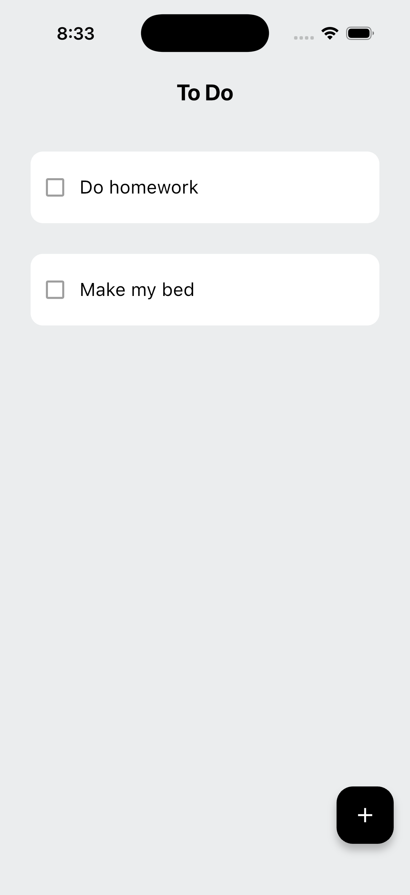
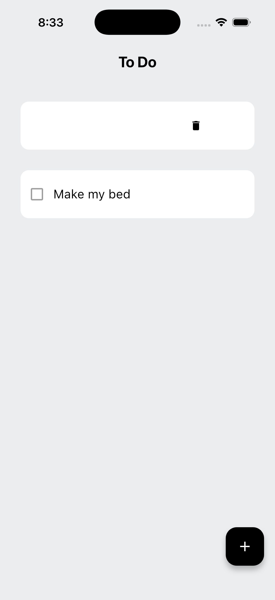
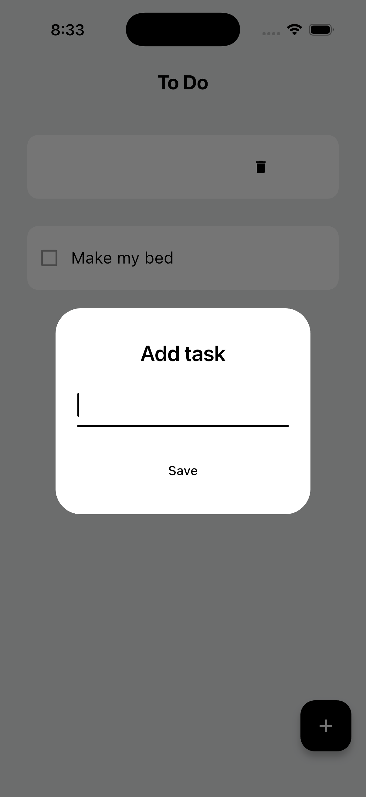

# Flutter-ToDo-App

A Flutter to-do list app using SQLite to practice local data persistence and state management.

---

## 📌 About the Project

This project is a beginner-friendly Flutter application built to learn how to:
- Create and manage UI with Material Design
- Handle state using `StatefulWidget` and `setState`
- Store and retrieve data locally using SQLite
- Build a simple but complete CRUD-style app

The app allows users to add, view, complete, and delete tasks, with all data persisted locally on the device.

---

## ✨ Features

- Add new tasks
- View a list of tasks
- Mark tasks as completed
- Delete tasks
- Persistent local storage using SQLite
- Clean and simple Material UI

---

## 🧱 Tech Stack

- **Flutter**
- **Dart**
- **SQLite** (via `sqflite`)
- **Material Design**

---

## 🗂 App Structure (High-Level)

- UI built using Flutter widgets
- Task data stored in a local SQLite database
- Basic state management using `setState`
- Tasks loaded from the database on app startup

---

## 🎯 Learning Goals

This project was created to practice:
- Flutter widget trees
- User input handling
- List rendering with `ListView`
- Local database integration
- Basic app architecture for small Flutter apps

---

## Screenshots

